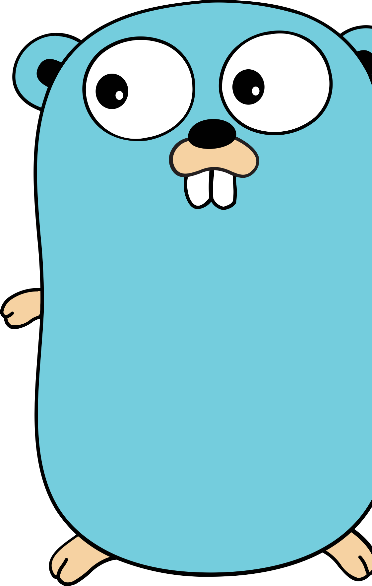

# Programowanie w języku Go

## Projekty:
## 1. [Ciekawe wnioski z badań liczby Fibonacciego](https://github.com/dawid-kalinowski/Golang/tree/main/projekt1)
## 2. [Symulacja palenia się lasu oraz optymalny sposób zasadzenia drzew](https://github.com/dawid-kalinowski/Golang/tree/main/projekt2)

## 3. [Błądzenie losowe w płaszczyźnie dwuwymiarowej](https://github.com/dawid-kalinowski/Golang/tree/main/projekt3)