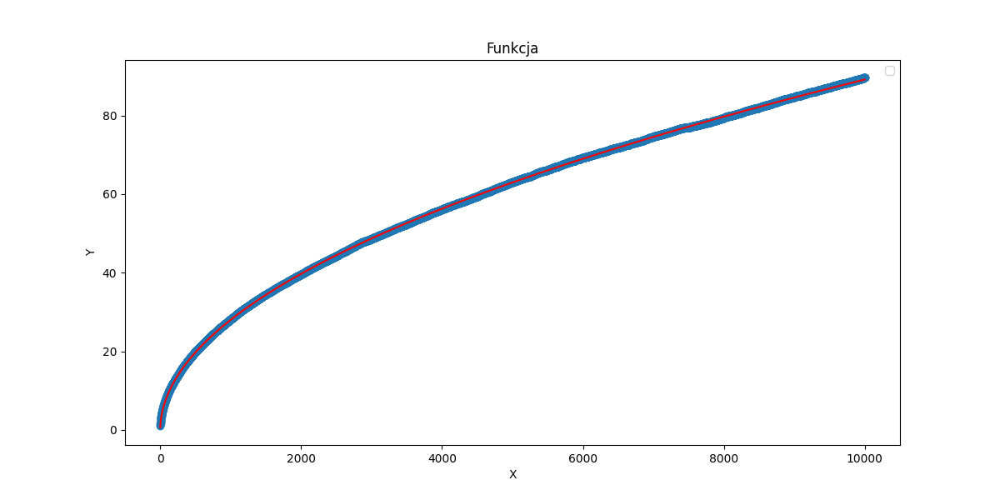
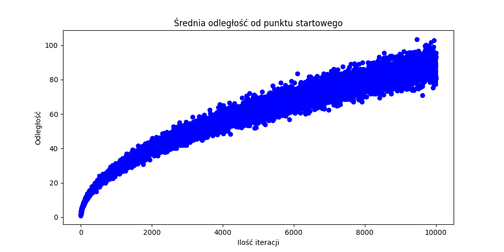
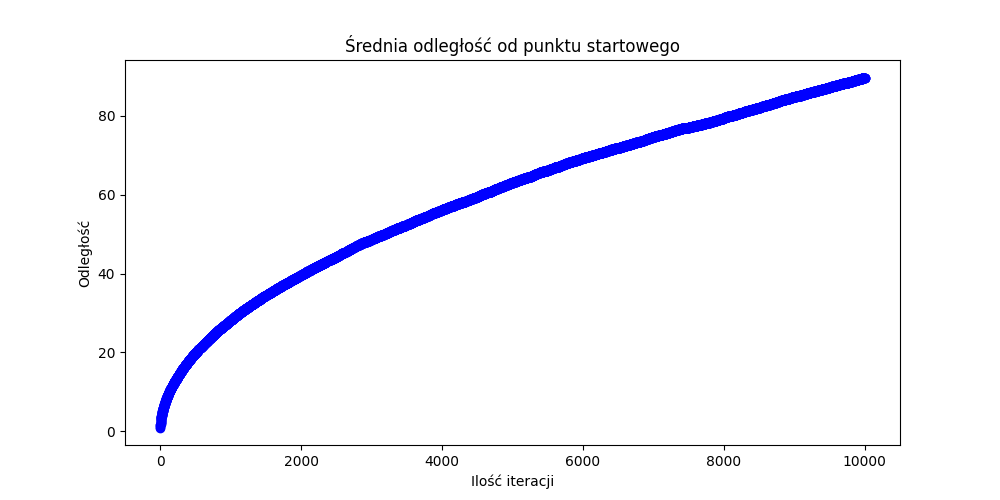
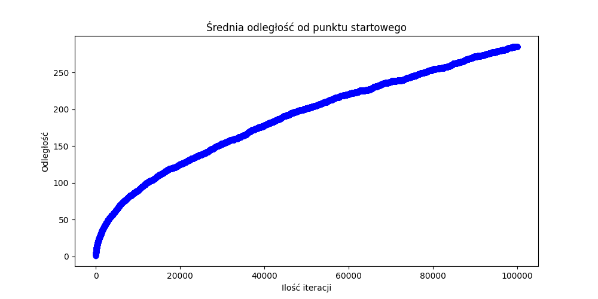

# Odległość punktu od środka układu kartezjańskiego po n losowych krokach.
## Wstęp
### Przedmiotem badań jest znalezienie następującej zależności:  
Jesteśmy w standardowym, dwuwymiarowym układzie współrzędnych z osiami X oraz Y.  
Punkt startowy to punkt `(0,0)`. Wykonujemy krok w losowym kierunku  (tzn. góra, dół, lewo, lub prawo, inaczej: Dodajemy lub odejmujemy 1 od wartości X lub Y.)  
Wykonujemy w ten sposób `n` kroków.
### Pytanie: po `n` krokach, do jakiej wartości, uśredniając, będzie dążyć odległość punktu od punktu startowego?

W badaniu sprawdziłem również wydajność różnych sposobów obliczenia tej liczby, oraz szybkość jężyków `Go` oraz `Python`.
## Rozdział I - Wyniki
#### Podejście "`wolne`", przypominajace nieco rekurencję:
Pliki `plaszczyzna.go` oraz `plaszczyzna.py` reprezentują następujące podejście:  
Tworzymy przykładowo 1000 punktów, ruszamy wszystkie o 1 krok, liczymy średnią odległość, zapisujemy ją, potem **powtarzamy symulację od początku**, tym razem ruszając każdy punkt o 2 kroki, i zapisując średnią odległość. Powtarzamy symulację od początku, losując jeden krok więcej, aż sprawdzimy wszystkie iteracje, na przykład do n = 10,000.
#### Podejście "`szybkie`".
To podejście reprezentują pliki `plaszczyzna_optimised.go`, oraz `plaszczyzna_optimised.py`.
Tworzymy od razu przykladowo 1000 punktów, ruszamy każdy o 1 krok, liczymy średnią i ją zapisujemy. Potem ruszamy każdy o kolejny 1 krok, liczymy średnią, i mamy średnią dla `n=2`. Wtedy, gdy jesteśmy w `n=10,000`, zamiast ruszać wszystkie 1000 punktów o 10,000 kroków, bierzemy symulację `n=9,999`, i ruszamy wszystkie punkty o tylko 1 krok.

### Podejście "szybkie", jest co prawda wydajniejsze, ale ma jedną wadę. Poszczególne iteracje nie są niezależne, tylko poprzednia iteracja ma istotny wpływ na kolejną, gdyż zmienia się ona tylko o jeden krok.

### Dane dla 10,000 iteracji po 1000 punktów.
Jak widać, wykres przypomina funkcję logarytmiczną. Po przeanalizowaniu danych, doszedłem do wniosku, że najbliżej tej funkcji jest funkcja **f(x) = √x**.
Jednak funkcja pierwiastek trochę odstaje od wyników. Badziej przybliżone wyniki wychodzą, kiedy pomnożymy pierwiastek razy około 0,888, czyli funkcja **f(x) = 0,888 * √x**  
Funkcja curve_fit z biblioteki scipy powiedziała, że te dane opisuje funkcja **f(x) = 0.8943 * √x - 0.2871** (plik ``znajdz_funkcje.py``), chociaż zwyłe pomnożenie przez 0,888 daje podobne wyniki.
Nawet, gdy policzyłem odległość dla jednej ilości kroków, ``26384``, ``100,000`` razy, to dalej wyszła liczba ``143.902045``, a pierwiastek z ``26384`` to ``162.431``. Po pomnożeniu przez ``0,888`` otrzymujemy w miarę przybliżony wynik, ``144.239``.  
#### Dokładnie wyniki w plikach ``srednie1-3.csv``.

## Rozdział II - porównanie metod i języków

1000 kroków po 1000 symulacji w języku GO:  
Sposób szybki: Czas wykonania: 0.0355s  
Sposób wolny: Czas wykonania: 11.6296s  
327.5 razy szybciej, ale wyniki są wtedy zależne od poprzednich iteracji  
  
Dla porównania, sposób szybki, 1000 symulacji:  
10,000 kroków: 329.2778ms  
100,000 kroków: 3.4666s  
1,000,000 kroków: 1m 14.70s  

### A co z Pythonem?
Sposób wolny, 100 kroków po 1000 symulacji:  
Python: 2.95s  
GO: 0.1161s

Sposób wolny, 1000 kroków po 1000 symulacji:  
Python: 400s  
GO: 13,20s

Sposób szybki, 10,000 kroków po 1000 symulacji:  
Python: 10.37s  
GO: 0.372s  

Dokładne wyniki z konsoli w pliku dane/wyniki.txt
### Werdykt: GO około 30 razy szybszy.
## Rozdział III - Wykresy

### 10,000 kroków ale tylko po 100 symulacji, dlatego wykres jest dosyć nieregularny.  
  
### 10,000 kroków, po 10,000 symulacji, tutaj wykres ewidentnie przypomina funkcję logarytmiczną.  

### Poprzednie 2 wykresy reprezentowały metodą wolną, przez co wykres był gładki, tutaj metoda szybka, widzimy niewielkie nieregularności.  

### Metoda wolna dla 1,000,000 kroków
