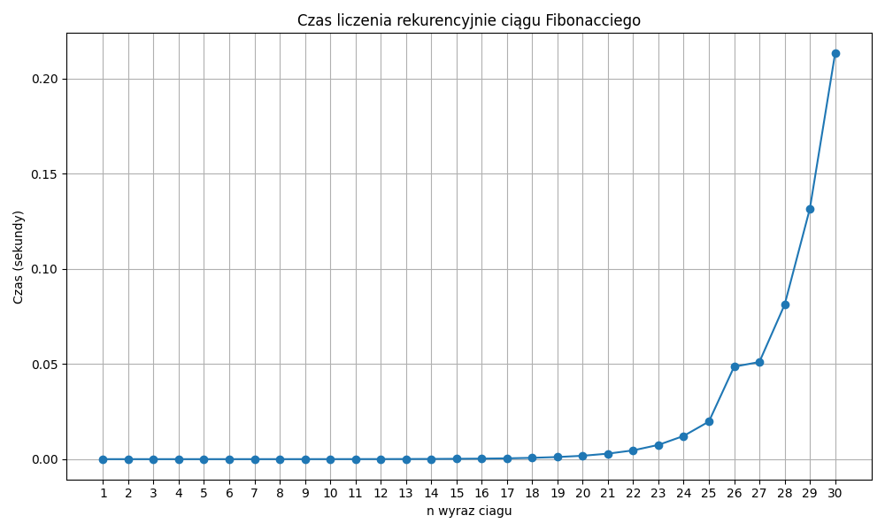
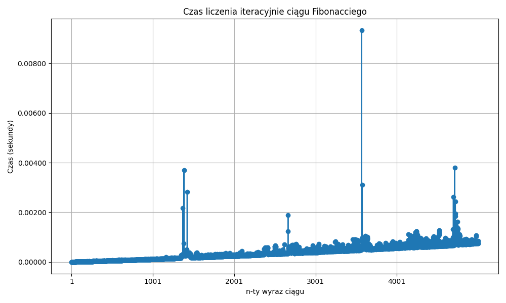

# Silne i Słabe liczby w języku GO
## Wstęp.
Kody ASCII mojego nicku to [100, 97, 119, 107, 97, 108]
Chcąc dowiedzieć się, jaka jest Moja Silna Liczba, założyłem, że wszystkie kody muszą wystąpić w tej samej kolejności, jak w imieniu, czyli najpierw 100(d), dopiero potem 97 (a), itd. Znalazłem `476`, bo to pierwsza liczba, której silnia spełnia założenia.

35867867064398478289209288875534387019028416258811836097155671133214919145444260935805432``100``5572035266352``97``136372252064698892609981421602639632038857887829475680340687505785927330492899589147639440355071247941210396418976790496116638139844315723889910751888763214906402206414338520669922794130323497648626571442758115898723512911338574508975674744299325488079349804387736838497922290989218810430929600444317990195672429289253146597780504680``119``7``107``6530754246327954624986988112268165923994505060387432953423056098694968718150841505607884240470917434237425103156812824015657``97``4571003990795766540721401679579244658446588446164169203675818430986591556111830196596277456004702842793415451383666382385636675472296471718568414870212881991381210132709571750867388``108``2348629325961023547740711742985105209962397132625285663757717550333733499916097970929256584070049965155727074714934204283094829846721551122905670975430021850311566169589525408067135863332586651648000000000000000000000000000000000000000000000000000000000000000000000000000000000000000000000000000000000000000000000  
  
Moja słaba liczba, to z kolei `17`.  
  
W trakcie zajmowania się problemem zauważyłem kilka ciekawostek...

## Rozdział I. Liczba wywołań funkcji

**Fakty**:  
30\. element ciągu Fibonacciego wynosi `832040`.  
Liczba wywołań funkcji dla `n=1` wynosi tyle, ile wartość ciągu dla `n` podanego na początku, co wynika oczywiście wprost z samej definicji ciągu Fibonacciego.  
  
  **Ale co ciekawe**, ilość wywołań funkcji dla `n=2` jest równa `29.` elementowi ciągu Fibonacciego, dla `n=3` jest równa `28.`, itd. Dochodzimy do wniosku, że dla rekurencyjnej funkcji `Fibonacci(pn)`, gdzie `pn` to nasze `początkowe n`, **Liczba wywołań funkcji Fibonacciego dla każdego n wynosi `Fib(pn - n + 1)`.**
Czyli, mówiąc po ludzku, ilość wywołań funkcji Fibonacciego po kolei każdego `n` od tyłu tworzy ciąg Fibonacciego.
    
Być może jest to oczywiste, ale ja osobiście odkryłem tę zależność dopiero, jak program zliczył mi ręcznie wszystkie wywołania funkcji dla wszystkich `n`.

### Tabelka:
| n | Liczba wywołań funkcji F(n)  |
|------------------|---------|
| 0                | 514229  |
| 1                | 832040  |
| 2                | 514229  |
| 3                | 317811  |
| 4                | 196418  |
| 5                | 121393  |
| 6                | 75025   |
| 7                | 46368   |
| 8                | 28657   |
| 9                | 17711   |
| 10               | 10946   |
| 11               | 6765    |
| 12               | 4181    |
| 13               | 2584    |
| 14               | 1597    |
| 15               | 987     |
| 16               | 610     |
| 17               | 377     |
| 18               | 233     |
| 19               | 144     |
| 20               | 89      |
| 21               | 55      |
| 22               | 34      |
| 23               | 21      |
| 24               | 13      |
| 25               | 8       |
| 26               | 5       |
| 27               | 3       |
| 28               | 2       |
| 29               | 1       |
| 30               | 1       |

## Rozdział II. Złoty podział

Kolejna rzecz,  
Zastanawiało mnie, o ile się zwiększa ilość wykonań funkcji z każdym kolejnym `n`, i jak zacząłem dzielić przez siebie ilość wykonań funkcji (czyli dzieliłem `n`-ty element ciągu Fibonacciego przez `n-1` element ciągu), to zauważyłem, że **ta proporcja BARDZO SZYBKO** (tzn już dla pierwszych elementów) **zaczyna przypominać stałą** i wynosi **~1.618** czyli jest **ZŁOTĄ LICZBĄ!**. Zamiast rekurencji, oczywiście warto liczyć iteracyjnie, ale alternatywą dla otrzymywania kolejnych elementów ciągu Fibonacciego może być mnożenie kolejnych elementów przez przybliżenie złotej liczby, oraz zaokrąglenie w dół do cyfry jedności.

## Rozdział III. Czas działania też??? 😵
Sugerując się treścią zadania, postanowiłem zmierzyć czas liczenia rekurencyjnie funkcji Fibonacciego dla różnych `n`. Oczywiście, funkcja rośnie wykładniczo, ale co ciekawe, jeżeli podzielimy czas działania dla elementu `n` przez czas działania dla `n-1`, znowu, bardzo szybko ta proporcja zmierza do **złotej liczby**.  

| n   | Czas liczenia (s)| Stosunek czasu do poprzedniego |
|-----|--------------|--------------------------------|
| 1   | 0.0000007153 |                                |
| 2   | 0.0000009537 | 1.33329                        |
| 3   | 0.0000009537 | 1.0                            |
| 4   | 0.0000007153 | 0.75003                        |
| 5   | 0.0000009537 | 1.33329                        |
| 6   | 0.0000030994 | 3.24987                        |
| 7   | 0.0000028610 | 0.92308                        |
| 8   | 0.0000042915 | 1.5                            |
| 9   | 0.0000069141 | 1.61111                        |
| 10  | 0.0000112057 | 1.6207                         |
| 11  | 0.0000181200 | 1.61703                        |
| 12  | 0.0000288486 | 1.59209                        |
| 13  | 0.0000441074 | 1.52893                        |
| 14  | 0.0000724792 | 1.64324                        |
| 15  | 0.0001153946 | 1.59211                        |
| 16  | 0.0002038479 | 1.76653                        |
| 17  | 0.0003063679 | 1.50292                        |
| 18  | 0.0005016327 | 1.63735                        |
| 19  | 0.0007898807 | 1.57462                        |
| 20  | 0.0012705326 | 1.60851                        |
| 21  | 0.0020649433 | 1.62526                        |
| 22  | 0.0033750534 | 1.63445                        |
| 23  | 0.0054795742 | 1.62355                        |
| 24  | 0.0088250637 | 1.61054                        |
| 25  | 0.0145370960 | 1.64725                        |
| 26  | 0.0236260891 | 1.62523                        |
| 27  | 0.0381035805 | 1.61278                        |
| 28  | 0.0617091656 | 1.61951                        |
| 29  | 0.0998525619 | 1.61812                        |
| 30  | 0.1628260612 | 1.63066                        |
| 31  | 0.2572720051 | 1.58004                        |
| 32  | 0.4154846668 | 1.61496                        |
| 33  | 0.7016372681 | 1.68872                        |
| 34  | 1.3900573254 | 1.98116                        |
| 35  | 2.4276556969 | 1.74644                        |
| 36  | 3.9783451557 | 1.63876                        |
| 37  | 6.3765065670 | 1.6028                         |
| 38  | 10.1886794567| 1.59785                        |
| 39  | 16.3728692532| 1.60697                        |
| 40  | 26.5859353542| 1.62378                        |
| 41  | 42.4968469143| 1.59847                        |
| 42  | 64.1382308006| 1.50925                        |
| 43  | 112.1614754200| 1.74875                        |
| 44  | 175.1904096603| 1.56195                        |
| 45  | 292.0188045502| 1.66687                        |
| 46  | 466.0715682507| 1.59603                        |

### Średni przyrost czasu: 1.5998855020597558
### Mediana przyrostów czasu:  1.6127756201511996

Na tej podstawie można łatwo policzyć, ile zajęłoby liczenie Mojej Silnej Liczby - ``476``- elementu ciągu Fibonacciego.
Mnożymy 466.0715682507 * 1.618033988749, łącznie wykonujemy tę czynność 430 razy, aby otrzymać czas liczenia rekurencyjnie dla ``476``.  
Wynosi on 3.413e+68 sekund, czyli...:

## Rozdział IV. Kosmicznie Wielkie Liczby 🚀
### 10815184952513580668197183636138704879232346890464417356557980247600139694918418300928
lat.

Zakładając, że wszechświat istnieje
[13.787 mld lat](https://en.wikipedia.org/wiki/Age_of_the_universe),
liczenie zajęłoby 784448027309318999217533120835415838030308472049079687916741034972127690752 wszechświatów.

A ja myślałem, że jak zostawię komputer na noc, to rano będzie już policzone...

Jak dobrze, że ludzkość nie używa rekurencji na codzień... Dla zestawienia, wykres liczenia "po ludzku", "normalnie", "tak, jak przystało na przyzwoitych ludzi":

A, i Fibonacci od Mojej Silnej Liczby iteracyjnie liczy się 6.5968e+96 razy szybciej niż rekurencyjnie

## Przemyślenia końcowe.

Nie widzę możliwości policzenia czasu działania, ani różnicy w czasie działania pomiędzy kolejnymi wartościami `m` i `n` nawet dla małych wartości w funkcji Ackermanna, tak więc tym bardziej nie jestem w stanie znaleźć żadnej zależności, ani nawet próbować przewidywać czasu działania programu.  

Funkcja Ackermanna od `(476,17)` przyjmuje wartość `(2→(20)→(474)) - 3`